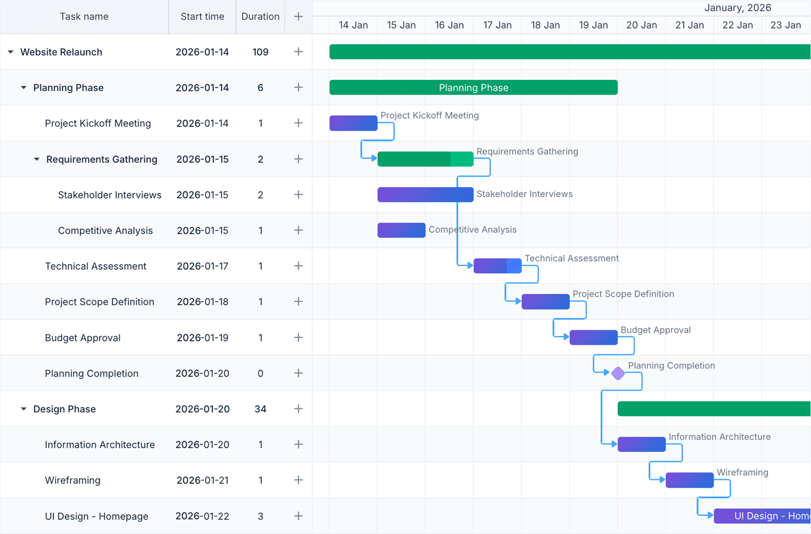

# DHTMLX Gantt - JavaScript Gantt Chart (Community Edition)

[](https://www.npmjs.com/package/dhtmlx-gantt) · [](LICENSE.md) · [](https://dhtmlx.com/)


[Quick start](#quick-start) | [Build from source](#build-from-source) | [Features](#features) | [Community vs PRO](#community-vs-pro) | [Frameworks](#framework-integration) | [License](#license) | [Links](#useful-links)

`dhtmlx-gantt` is an open-source JavaScript Gantt chart library for visualizing and managing project schedules: a configurable task grid, a zoomable timeline, projects and milestones, four dependency link types, drag-and-drop scheduling, data export, and 32 built-in locales.

It is a framework-agnostic component that works with plain JavaScript and integrates with React, Angular, Vue, and Svelte.



This is the **Community Edition** of DHTMLX Gantt - distributed as the `dhtmlx-gantt` npm package under the **MIT License** and shipped as **readable source code** you can fork, modify, and rebuild. For advanced project management capabilities such as auto-scheduling, critical path, and resource management, see the [PRO edition](#community-vs-pro).

---

## Quick start

Install the package, import the script and styles, and initialize the chart in a container element.

### Install

```bash
npm install dhtmlx-gantt
```

### Import

With a module bundler (Vite, webpack, Rollup, …):

```js
import { gantt } from "dhtmlx-gantt";
import "dhtmlx-gantt/codebase/dhtmlxgantt.css";
```

The side-effect import also registers a global `gantt`, so plain `<script>` tags work against the bundled files in `codebase/`:

```html
<script src="codebase/dhtmlxgantt.js"></script>
<link rel="stylesheet" href="codebase/dhtmlxgantt.css">
```

### Add a container

```html
<div id="gantt_here" style="width: 100%; height: 600px;"></div>
```

### Initialize

```js
gantt.config.date_format = "%Y-%m-%d";

gantt.init("gantt_here");

gantt.parse({
    data: [
        { id: 1, text: "Website redesign", type: "project",    progress: 0.4, open: true },
        { id: 2, text: "Research",         start_date: "2026-06-01", duration: 4, parent: 1, progress: 1 },
        { id: 3, text: "Wireframes",       start_date: "2026-06-05", duration: 6, parent: 1, progress: 0.6 },
        { id: 4, text: "Visual design",    start_date: "2026-06-11", duration: 8, parent: 1, progress: 0.2 },
        { id: 5, text: "Launch",           start_date: "2026-06-19", type: "milestone", parent: 1 }
    ],
    links: [
        { id: 1, source: 2, target: 3, type: "0" },  // finish-to-start
        { id: 2, source: 3, target: 4, type: "0" },
        { id: 3, source: 4, target: 5, type: "0" }
    ]
});
```

[See a live demo](https://snippet.dhtmlx.com/a69d7378a) · or run the bundled gallery with [`npm run start`](#build-from-source) and open `/samples/`.

---

## Build from source

Unlike a compiled-only distribution, the Community Edition ships its TypeScript/JavaScript sources and LESS styles, so you can read, change, and rebuild the library.

```bash
git clone https://github.com/DHTMLX/gantt.git
cd gantt
npm install

npm run build     # builds codebase/dhtmlxgantt.js (+ es module, css, d.ts)
npm run start     # dev mode: watch build + samples server at http://localhost:5173
npm run test      # builds, then loads every sample and fails on console errors
npm run lint      # eslint over src/
```

`codebase/` is build output (generated, not committed). After `npm run build` you can serve the files from `codebase/` directly via `<script>` tags, exactly like the npm package.

### Repository layout

```
src/        library sources (TypeScript + JavaScript, LESS styles)
samples/    runnable demos (npm run start, then open /samples/)
scripts/    build, dev server, and test runner scripts
codebase/   build output (generated, not committed)
```

### Testing

```bash
npm run test                 # smoke test: builds, then loads every sample
npm run test 05_lightbox     # smoke just one samples folder
npm run lint                 # eslint over src/
```

`npm run test` is a smoke pass: it loads every built sample headless and fails if any page throws or logs a `console.error`. It runs the build first; pass `--no-build` to skip it (e.g. in CI, where the build is a separate step).

---

## Basic usage

### Configuring the grid and time scale

```js
// Configure grid columns
gantt.config.columns = [
    { name: "text",       label: "Task",  tree: true, width: 220 },
    { name: "start_date", label: "Start", align: "center", width: 90 },
    { name: "duration",   label: "Days",  align: "center", width: 60 },
    { name: "add",        label: "",      width: 44 }   // add-task button column
];

// Set the time scale unit and step
gantt.config.scale_unit = "week";
gantt.config.date_scale = "%M %d";

// Highlight weekends on the timeline
gantt.templates.scale_cell_class = function (date) {
    if (date.getDay() === 0 || date.getDay() === 6) return "weekend";
};

gantt.init("gantt_here");
```

### Enabling plugins

Activate optional extensions before calling `gantt.init()`:

```js
gantt.plugins({
    tooltip:             true,   // hover tooltips on task bars
    quick_info:          true,   // touch-friendly task popup
    fullscreen:          true,   // fullscreen toggle
    keyboard_navigation: true,   // arrow-key navigation
    drag_timeline:       true,   // drag to scroll the timeline
    click_drag:          true    // draw new tasks by dragging on the timeline
});

gantt.init("gantt_here");
```

### Multiple chart instances

Render several independent Gantt charts on one page with the `Gantt` factory:

```js
import { Gantt } from "dhtmlx-gantt";

var chartA = Gantt.getGanttInstance();
var chartB = Gantt.getGanttInstance();

chartA.init("gantt_a");
chartB.init("gantt_b");
```

The default `gantt` export is itself an instance created this way, so existing single-chart code keeps working unchanged.

### Reacting to changes

```js
gantt.attachEvent("onAfterTaskUpdate", function (id, task) {
    fetch("/api/tasks/" + id, {
        method: "PUT",
        headers: { "Content-Type": "application/json" },
        body: JSON.stringify(task)
    });
});

gantt.attachEvent("onAfterLinkAdd", function (id, link) {
    fetch("/api/links", {
        method: "POST",
        body: JSON.stringify(link)
    });
});
```

For two-way sync with a REST backend, use the bundled `dataProcessor` - see [Backend integration](#backend-integration).

---

## Features

The Community Edition covers the everyday Gantt feature set, **including projects (summary tasks) and milestones**:

- **Task grid** - any number of configurable columns, a tree column, and inline cell editing
- **Projects / summary tasks and milestones** - task types with type-aware rendering and lightbox
- **Zoomable time scale** - single or dual scale; configurable unit (hour … year) and step
- **Four dependency types** - finish-to-start, start-to-start, finish-to-finish, start-to-finish, with lag and drag-to-create links
- **Drag-and-drop scheduling** - move task bars to reschedule; resize bars to change duration
- **Progress indicators** - completion shown as a filled bar segment, editable in the lightbox
- **Lightbox task editor** - configurable modal dialog; add your own controls
- **Smart rendering** - only visible rows/columns are drawn, for large datasets
- **Multiple chart instances** - render several independent Gantts on one page via the `Gantt` factory
- **Templates** - override any rendered element (bars, grid cells, scale cells, tooltips)
- **Plugins** - tooltips, quick info, keyboard navigation, fullscreen, drag-timeline, click-drag
- **Grid column resizing** and a column-configuration API
- **Data loading/saving** - JSON/XML parsing and serialization, REST `dataProcessor`
- **Export** - to PDF, PNG, Excel, iCal, and MS Project via the DHTMLX online export service
- **Skins** - Material, Terrace, Meadow, Broadway, Skyblue, and more
- **32 locales**, WAI-ARIA accessibility, touch support, CSP-compliant mode
- **Event system** - 100+ events covering interactions and lifecycle hooks
- **TypeScript** - bundled type definitions

> **Note:** `codebase/dhtmlxgantt.d.ts` describes the full product API, so it lists some PRO-only methods that are not present in this edition.

---

## Community vs PRO

This edition is intended for schedule visualization and manual editing. Production project-management features - auto-scheduling, critical path, resource planning - are part of the commercial **PRO edition**.

| Feature | Community (MIT) | PRO |
|:---|:---:|:---:|
| Task grid, columns, tree, inline editing | ✓ | ✓ |
| Zoomable single/dual time scale | ✓ | ✓ |
| Projects / summary tasks, milestones | ✓ | ✓ |
| Four dependency types (FS/SS/FF/SF) + lag | ✓ | ✓ |
| Drag-and-drop scheduling & bar resize | ✓ | ✓ |
| Progress, lightbox editor, templates | ✓ | ✓ |
| Smart rendering for large datasets | ✓ | ✓ |
| Multiple chart instances per page | ✓ | ✓ |
| Tooltips, quick info, keyboard nav, fullscreen | ✓ | ✓ |
| Drag-timeline, click-drag, grid column resize | ✓ | ✓ |
| Skins, 32 locales, accessibility, touch | ✓ | ✓ |
| JSON/XML loading, REST dataProcessor | ✓ | ✓ |
| Export to PDF/PNG/Excel/iCal/MS Project | ✓ | ✓ |
| **Auto-scheduling** | ✗ | ✓ |
| **Critical path & slack** | ✗ | ✓ |
| **Resource management** (assignments, histogram, grouping by resource) | ✗ | ✓ |
| **Baselines & deadlines** | ✗ | ✓ |
| **Constraints** | ✗ | ✓ |
| **Split tasks & rollups** | ✗ | ✓ |
| **WBS codes** | ✗ | ✓ |
| **Grouping** | ✗ | ✓ |
| **Dynamic (on-demand) loading** | ✗ | ✓ |
| **Undo / redo** | ✗ | ✓ |
| **Multi-task selection & drag** | ✗ | ✓ |
| **Timeline markers / today line** | ✗ | ✓ |
| **Unscheduled tasks & new-task placeholder** | ✗ | ✓ |
| **Working-time calendars** (setWorkTime, custom work calendars) | ✗ | ✓ |

### Need advanced project management features?

The **DHTMLX Gantt PRO edition** adds auto-scheduling, critical path calculation, resource management (assignments, histograms, and grouping by resource), working-time calendars, baselines and deadlines, constraints, split tasks, WBS, and dynamic data loading - capabilities designed for production project-management applications.

- [Compare Community and PRO editions](https://docs.dhtmlx.com/gantt/guides/editions-comparison/)
- [Download a free 30-day PRO trial](https://dhtmlx.com/docs/products/dhtmlxGantt/download.shtml)
- Contact us: [info@dhtmlx.com](mailto:info@dhtmlx.com)

---

## Framework integration

DHTMLX Gantt works with popular front-end frameworks. The PRO edition provides ready-made components (`ReactGantt`, `VueGantt`, `AngularGantt`); the Community Edition integrates via the standard wrapper patterns documented below.

- [React integration guide](https://docs.dhtmlx.com/gantt/integrations/react/js-gantt-react/)
- [Angular integration guide](https://docs.dhtmlx.com/gantt/integrations/angular/js-gantt-angular/)
- [Vue.js integration guide](https://docs.dhtmlx.com/gantt/integrations/vue/js-gantt-vue/)
- [Svelte integration guide](https://docs.dhtmlx.com/gantt/integrations/svelte/howtostart-svelte/)
- [Salesforce integration guide](https://docs.dhtmlx.com/gantt/integrations/salesforce/howtostart-salesforce/)

## Backend integration

The bundled `dataProcessor` provides two-way data sync between the chart and a REST API:

- [Node.js / Express](https://docs.dhtmlx.com/gantt/integrations/node/howtostart-nodejs/)
- [ASP.NET Core](https://docs.dhtmlx.com/gantt/integrations/dotnet/howtostart-dotnet-core/)
- [PHP / Laravel](https://docs.dhtmlx.com/gantt/integrations/php/howtostart-php-laravel/)
- [Ruby on Rails](https://docs.dhtmlx.com/gantt/integrations/other/howtostart-ruby/)
- [Python / Django](https://docs.dhtmlx.com/gantt/integrations/other/howtostart-python/)

---

## License

This Community Edition of DHTMLX Gantt is licensed under the **MIT License** - see [LICENSE.md](LICENSE.md).

You are free to use, copy, modify, merge, publish, distribute, sublicense, and sell copies of this software in any project, including closed-source and commercial applications, subject only to the MIT License terms. It is distributed in the hope that it will be useful, but WITHOUT ANY WARRANTY; without even the implied warranty of MERCHANTABILITY or FITNESS FOR A PARTICULAR PURPOSE.

Copyright © 2026 XB Software Ltd.

---

## Documentation and resources

The full product [documentation](https://docs.dhtmlx.com/gantt/) applies to this edition within the feature scope above.

- [Product page](https://dhtmlx.com/docs/products/dhtmlxGantt/open-source/) - overview, screenshots, and key features
- [Documentation](https://docs.dhtmlx.com/gantt/) - getting-started guides, configuration, and tutorials
- [API reference](https://docs.dhtmlx.com/gantt/api/) - config, templates, events, and methods
- [Live demos and samples](https://docs.dhtmlx.com/gantt/samples/) - interactive examples for each feature
- [Community forum](https://forum.dhtmlx.com/c/gantt) - Q&A and discussions

### AI-assisted development

Building with an AI coding assistant (Claude Code, Cursor, Codex…)? Two free helpers cover the `dhtmlx-gantt` package:

- [DHTMLX MCP Server](https://docs.dhtmlx.com/gantt/integrations/ai-tools/mcp-server/) - connects your assistant to up-to-date DHTMLX documentation and API reference.
- [Agent Skills](https://docs.dhtmlx.com/gantt/integrations/ai-tools/agent-skills/) - teach the assistant correct integration patterns and known pitfalls.

## Useful links

- [Export services](https://dhtmlx.com/docs/products/dhtmlxGantt/export.shtml)
- [Integrations](https://dhtmlx.com/docs/products/integrations/)

If this project helps you, please ⭐ the [GitHub repository](https://github.com/DHTMLX/gantt).
